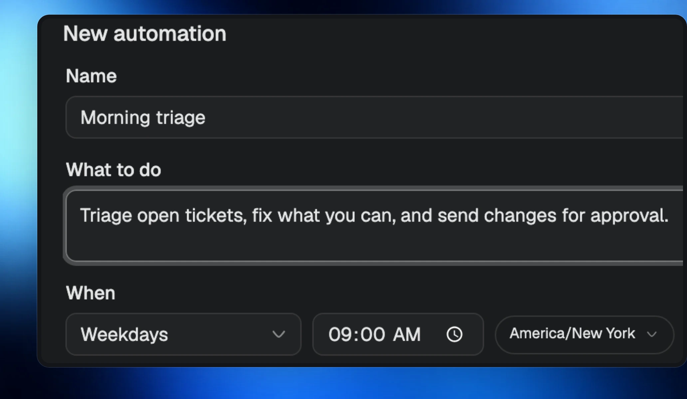
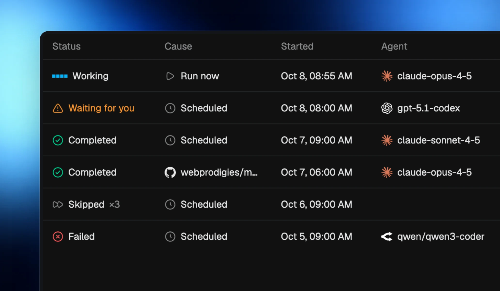
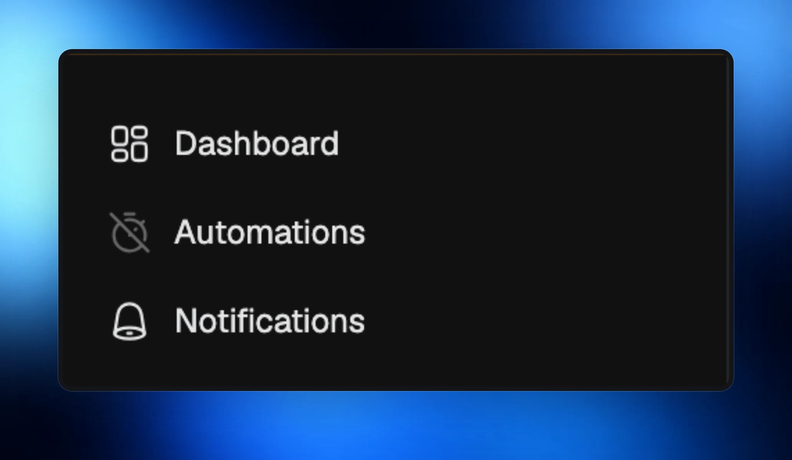

An automation is a saved prompt and when it runs. Each run starts a fresh room in your project, or sends the prompt to an existing room, with the model and access you choose.

## Choose when work starts

Run every hour, every day, on weekdays, or on the days you pick, in your own time zone. Choose **Run now** for work you want to start yourself. Ask an agent to set up an event trigger, such as a pull request’s checks passing.

## Follow every run

The runs list shows status, cause, start time, duration, agent, and room. Open a run’s room to follow its work or answer a request marked **Waiting for you**.

- An optional check command skips a run when there is nothing to do.
- While a run waits for your answer, later runs are skipped.
- After sleep, a missed scheduled run can catch up once within 12 hours.

## Pause without losing your setup

Pause one automation or all Automations. The sidebar shows when Automations are paused, and **Resume** puts them back on schedule. **Run now** still works while automatic starts are paused. Your pause survives a restart.

## Ask an agent to manage them

Agents can list, create, edit, pause, resume, run, and archive Automations for you. Ask for a schedule or an event trigger in plain language.

Automations are included with Pro. They can keep running when you close the window, from the menu bar or tray. **Open at login** is available in Settings. Automations on other computers you control show up too, with requests waiting for you.

## Connected apps

Settings › Connections brings your connected apps together. GitHub uses your CLI sign-in; Google Calendar can use your connected Calendar MCP server. MCP servers have their own page in Settings. Webhooks can bring outside events into Morphite for agents and Automations to act on.
