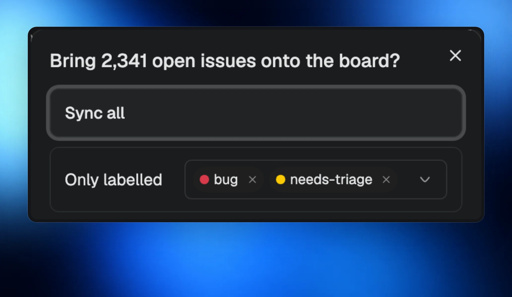
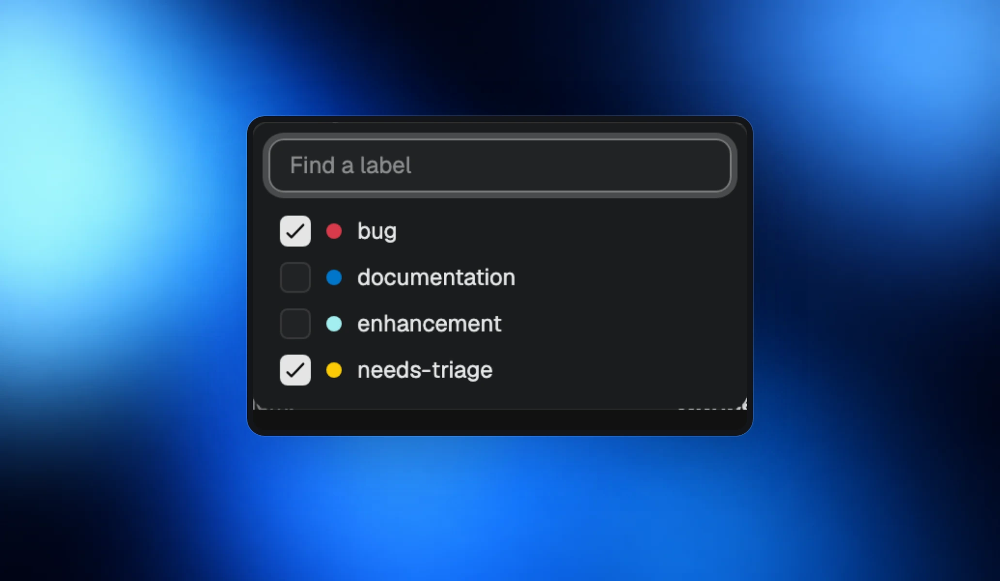
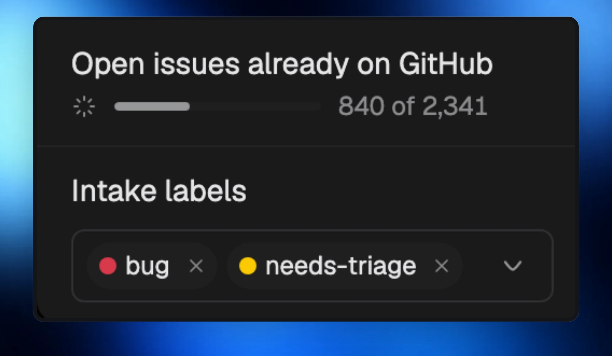

When a repository has more than 300 open issues, Morphite asks before bringing them onto your board.

## Choose what comes in

- **Sync all** imports every open issue, newest first.
- **Only labelled** imports issues carrying any of the labels you choose.
- **Cancel** leaves existing issues where they are.

Sync stays on either way: new and changed issues can still arrive.

## Pick labels from the repository

Pick several labels from GitHub’s own list. A repository shared by projects can route issues by each project’s labels. You can also remove intake labels that no longer exist on GitHub.

## Follow the import

Imports run in the background with progress in **Issue sync**, and can resume rather than start over. Large boards open and scroll smoothly.
