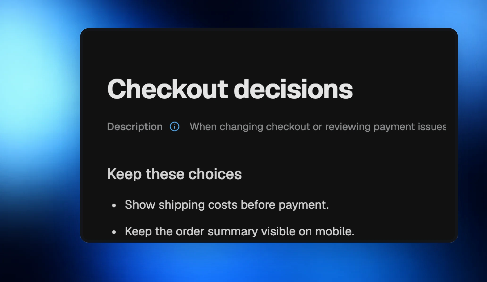
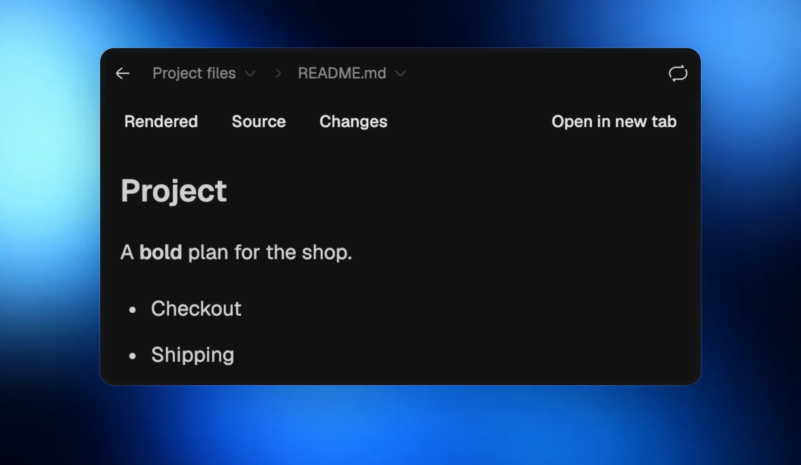
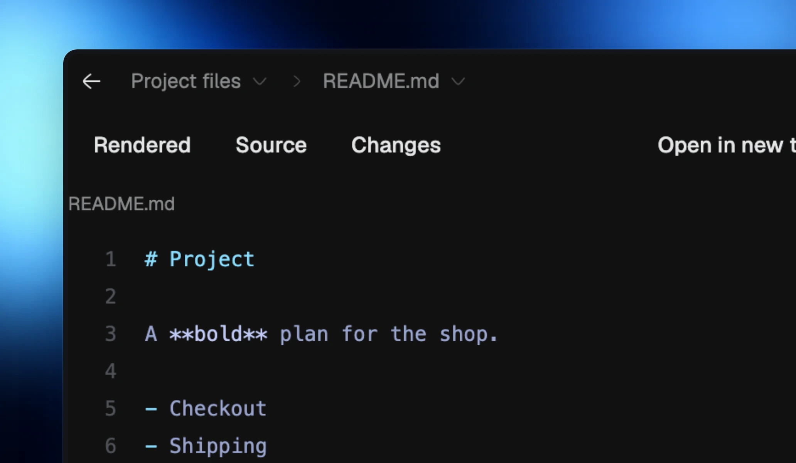

## Let agents keep useful knowledge

Agents can write decisions, project conventions, and reusable lessons into your company’s Brain. Those pages appear alongside the knowledge you write yourself, ready for later work.

The Brain guide helps agents decide what belongs there, find existing knowledge first, and update it when things change.

## Read Markdown as a document

Open a Markdown file from **Files** to read headings, lists, task lists and tables in the same renderer used by the Brain.

## Switch to Source

Use **Source** to inspect the original Markdown, then **Rendered** to return to the document.

## Improved

- Brain pages saved with Windows line endings open cleanly.
- Agents’ questions can offer several choices when more than one answer applies.
- Archived or long-idle worker folders can close in the background and reopen when needed, with their work kept.
- New and reopened worker folders reuse installed dependencies where possible.
- Projects can name their integration branch, and worker branches recover when their folder reopens.
- Claude’s background agents stay visible and can receive answers after the main reply.

## Fixed

- Queued messages are easier to recall into the composer.
- Background checks keep your current screen steady.
- Saved knowledge and other data stay intact when installing or updating Morphite.
