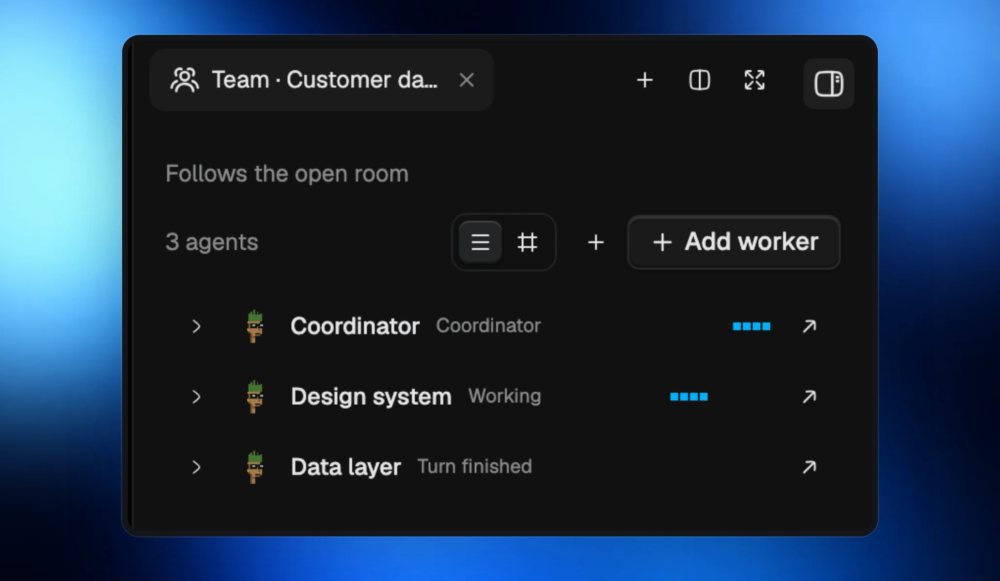

Rooms start instantly again, so you can get straight into the conversation.

## Keep parallel work moving

Your team’s changes come together more smoothly, with fewer blocked workers. Archiving a worker works reliably and keeps their work safe.

