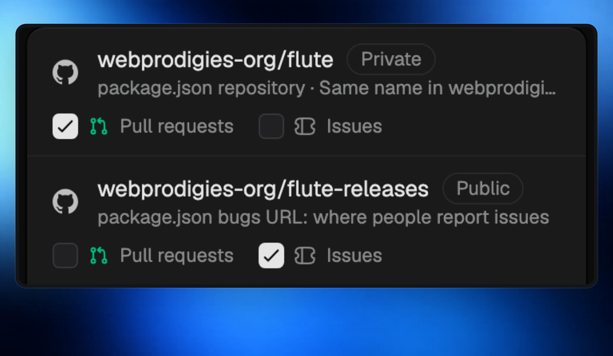
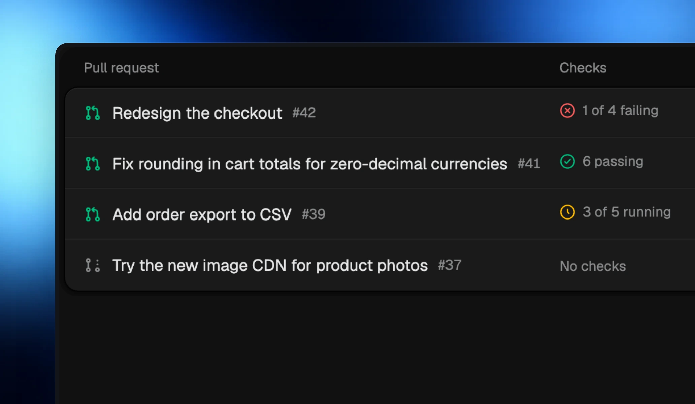
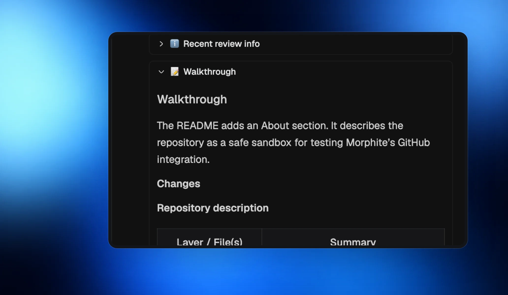

Connect GitHub in **Settings › Connections** with your GitHub CLI sign-in. Your projects can link repositories for pull requests, issues, or both.

## Link your repositories

Morphite finds repositories from your project folder and suggests the ones that belong to it. Choose their roles and connect them in one click.

## Pull requests at a glance

Open **Pull requests** beside your board to see branches, checks, and the room working on each pull request. Open one in the side panel, or use its link above a room’s chat box.

## Read the conversation

Comments show formatted text, tables, task lists, and collapsible review sections, so long reviews are easier to follow.

## Issues and tickets, in sync

Turn on **Issue sync** for a project to bring GitHub issues onto its board. Changes to linked titles and status travel both ways. Ticket progress appears in a Morphite status comment on the issue.

- When a ticket is done, close its issue or keep it open for review.
- Intake labels bring matching issues in, even if you keep new issues off.
- Repositories where you cannot write sync into Morphite one way.
- Nothing is imported or written until you turn on sync for that project.
