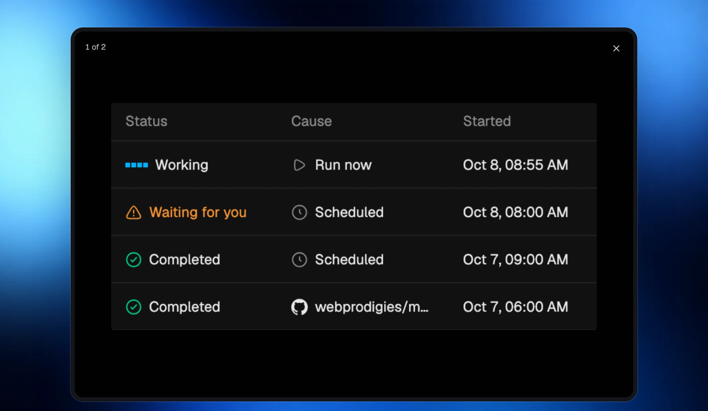

Open a picture from chat, Files, or a release note to see it in the shared image viewer.

## One place to view pictures

## Zoom into the details

Pinch or scroll to zoom around the point you are looking at. Double-click to zoom, drag to pan, or use the keyboard to look around. At the fitted size, Left and Right step through a group of pictures.

Close the viewer to return to the picture where you opened it.
