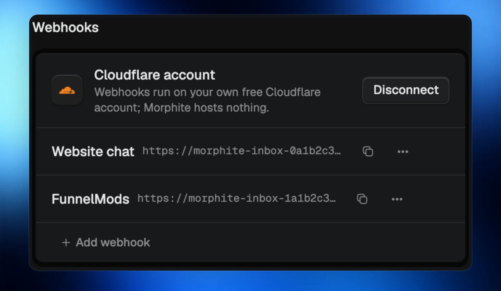
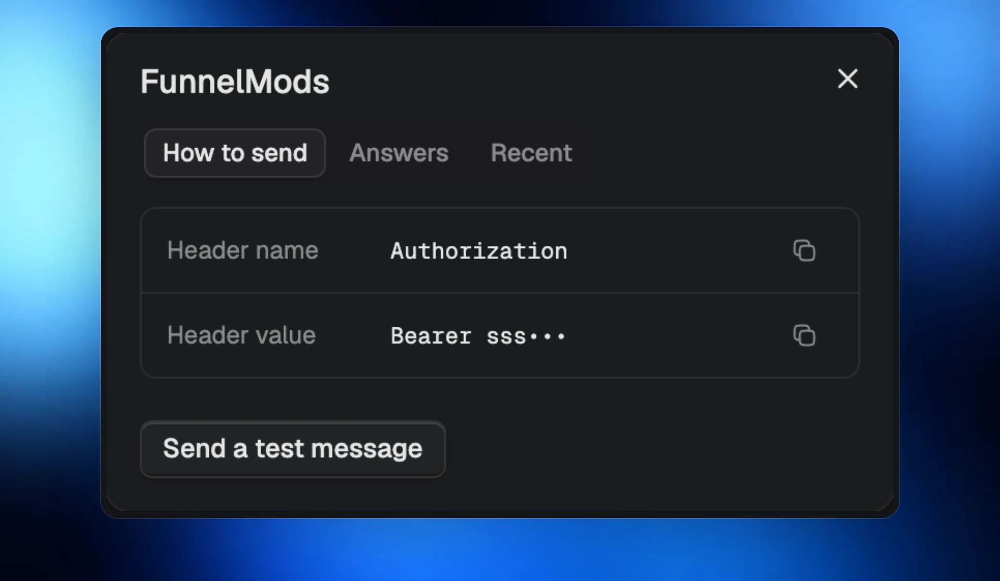
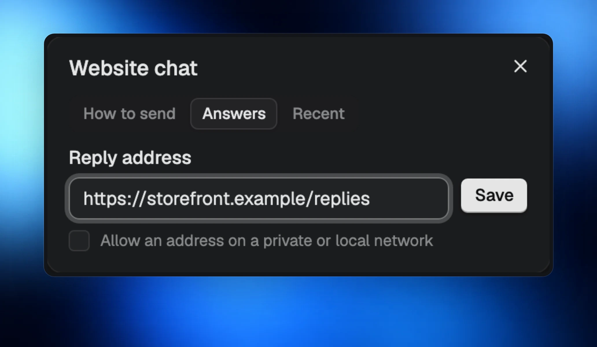

Messages arrive in well under a second, so your agents can start helping while the conversation is still happening. Each conversation gets its own room, with two-way replies that keep the answer with the right person.

## Connect your website and tools

Receive messages from FunnelMods, Zapier, Make, or a sender that signs its messages. Everything runs on your own free Cloudflare account. Connect it in **Settings › Connections**.

## Try a message, then keep talking

Use **Send a test message** to check your setup. Add a reply address so agents can answer back in the same conversation.

## You stay in control

Only signed messages or messages carrying your secret header are accepted. Morphite checks every message on your computer. Pause a webhook whenever you need to, and rotate its secret to replace the old one.
