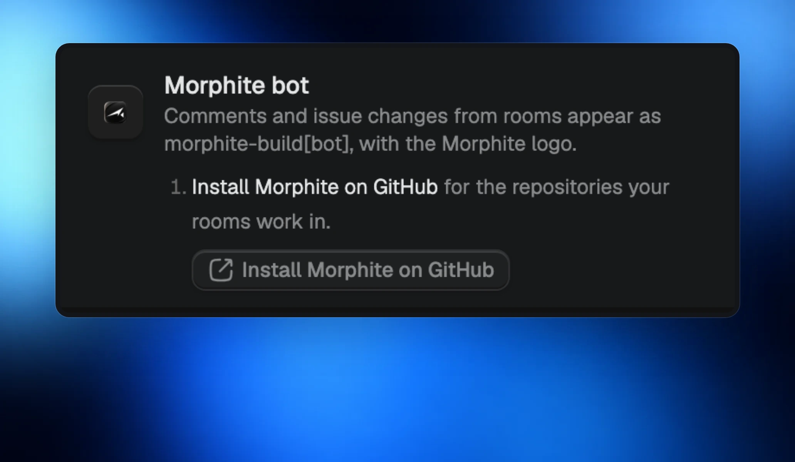
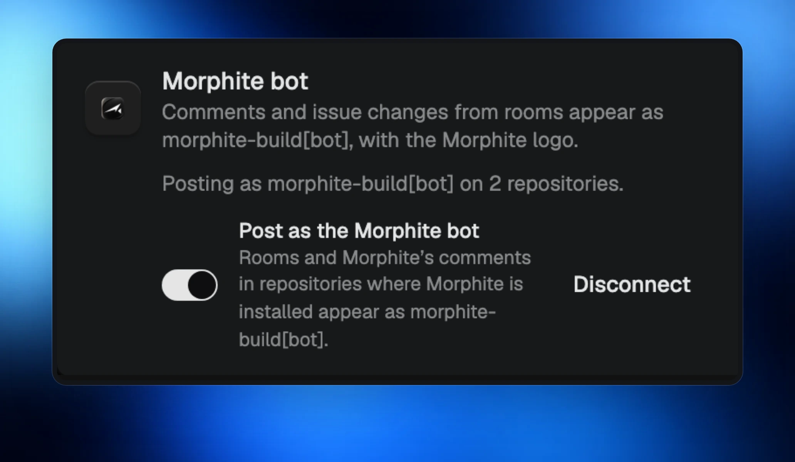

Give your rooms their own identity on GitHub. Comments and issue changes can now appear as **morphite-build[bot]**, with the Morphite logo, so it is clear when your room is doing the work.

## Install from Connections

Open **Settings › Connections**, choose **Morphite bot**, and install it on the repositories you want it to work with, then sign in with GitHub.

## Choose when your rooms use it

Turn **Post as the Morphite bot** on or off whenever you like.

