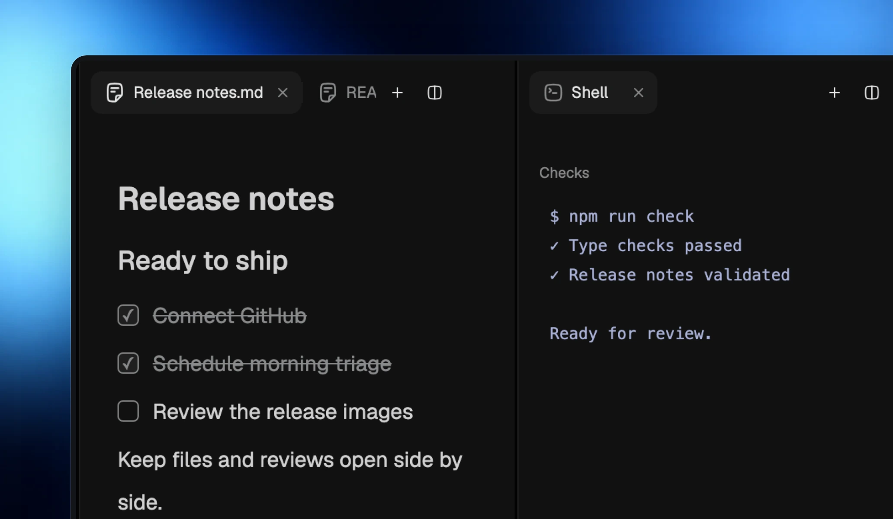
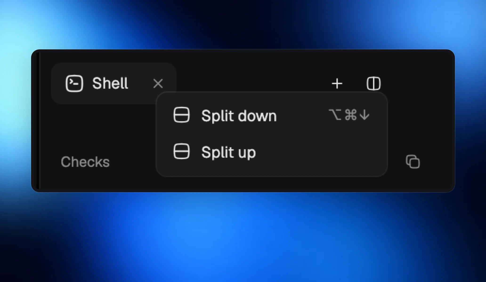

The side panel can hold up to four sections, side by side or stacked, each with its own tabs. Files, pull requests, tickets, chats and pages can stay open together.

## Keep the views you need

Your panel keeps its layout as you move between rooms and projects, and returns after a restart. New tabs open in the section you are using. If a tab is already open elsewhere, opening it brings it into that section.

## Move work into place

Drag tabs between sections, or drag in files, tickets, pull requests and Automations. Drop in a section to open there, or at an edge to split. Use a tab’s menu to split or move it with the keyboard.

## Shortcuts

- **⌘\** splits right; **⌘⌥↓** splits down. Use Ctrl instead of ⌘ on Windows.
- **⌘⌥→** and **⌘⌥←** move between sections.
- **⌘⌥⇧→** moves the current tab to the next section.
- **⌘⇧W** closes a section and lets the others fill the space.

On a small window, sections stack. A panel covering the page steps aside when you open another page.
