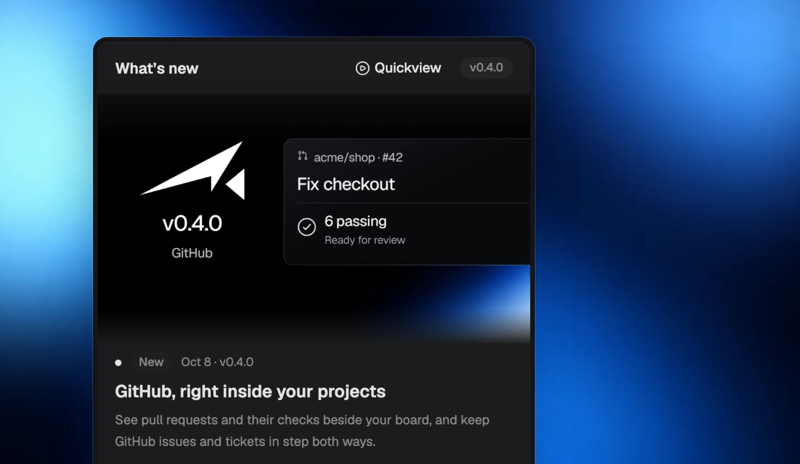
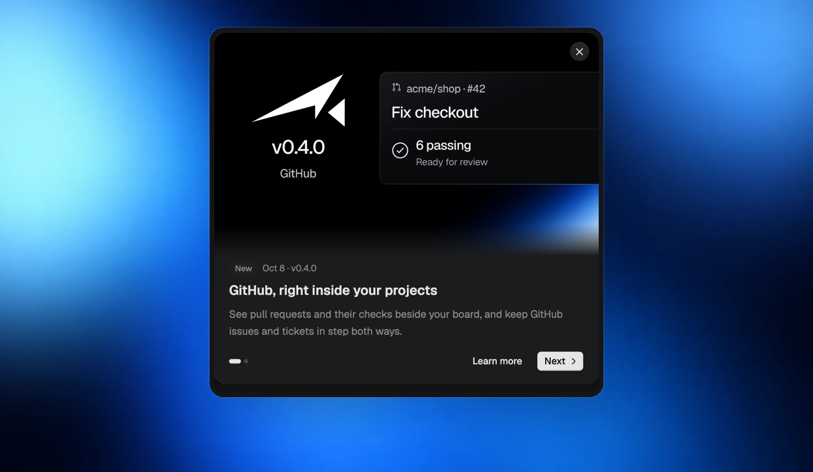

Open **What’s New** from the sidebar to see the latest update and earlier releases in one place. Open any update to read its full notes, pictures, and videos.

## Read what changed

Unread updates have a small dot. Your installed version is shown in the header, and available app updates can be opened from here.

## Replay the highlights

The launch overview introduces new highlights with **Next**, **Back**, and **Learn more**. **Quickview** replays it whenever you want.

Pictures open in the image viewer and close back to the notes where you left off.
